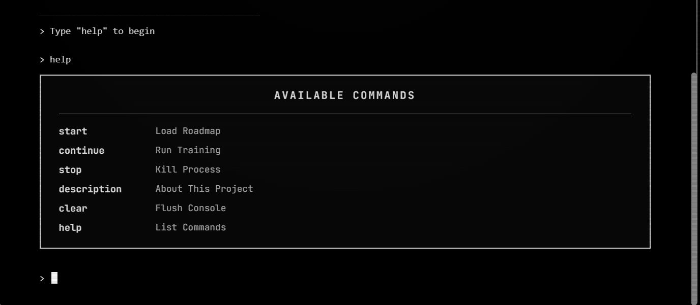
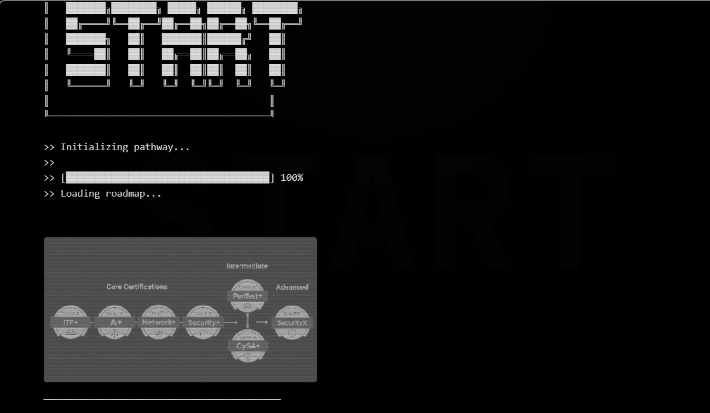
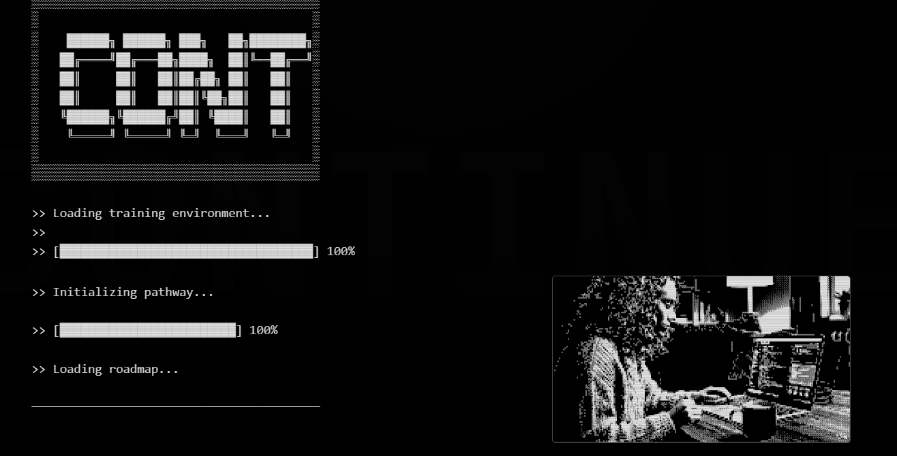
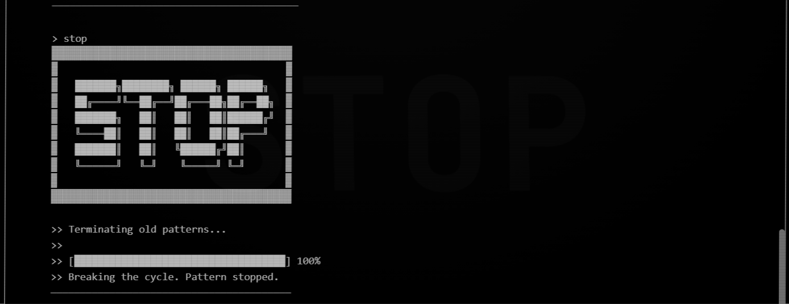
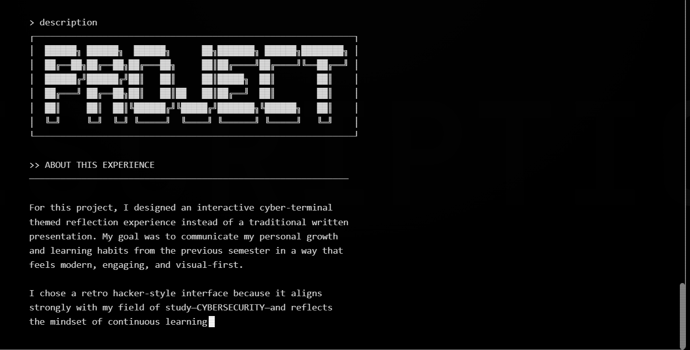

# 🖥️ SELF-UPGRADE SEQUENCE v1.0

> An interactive cyber-terminal themed reflection experience built for a cybersecurity portfolio.



---

## 📋 About

This project is an **interactive cyber-terminal interface** designed as a creative reflection on personal growth and learning habits. Instead of a traditional written presentation, it uses a retro hacker-style terminal to communicate key concepts through:

- 🟢 **Visual metaphors** and ASCII art
- 📊 **Animated progress bars**
- ⚡ **Glitch transitions** and CRT effects
- 🎨 **Color symbolism** (green = launch, yellow = progress, red = stop)

---

## 🚀 How to Open Locally

### Option 1: Direct File Open
Simply double-click `index.html` to open it in your default browser.

### Option 2: Using VS Code Live Server
1. Install the **Live Server** extension in VS Code
2. Right-click on `index.html`
3. Select **"Open with Live Server"**

### Option 3: Using Python HTTP Server
```bash
# Navigate to the project folder
cd path/to/stop

# Python 3
python -m http.server 8000

# Then open http://localhost:8000 in your browser
```

### Option 4: Using Node.js
```bash
# Install serve globally
npm install -g serve

# Run the server
serve .

# Open the provided URL in your browser
```

---

## ⌨️ Available Commands

| Command | Description |
|---------|-------------|
| `help` | Display available commands |
| `start` | Load the certification roadmap |
| `continue` | Run TryHackMe training animation |
| `stop` | Terminate old learning patterns |
| `description` | About this project |
| `clear` | Clear the terminal |
| `exit` | End the session |

---

## 📸 Screenshots

### Help Menu

*Available commands displayed in a styled grid*

### Start Command

*Loads the certification roadmap with glitch transition effects*

### Continue Command

*Displays TryHackMe hands-on training with embedded video*

### Stop Command

*Terminates old patterns with intense glitch effects*

### Description Command

*Typewriter-animated project explanation*

---

## 📁 Project Structure

```
stop/
├── index.html      # Main terminal interface
├── cert.png        # Certification roadmap image
├── thm.mp4         # TryHackMe training video
├── README.md       # This file
└── screenshots/    # Screenshot images
    ├── help.png
    ├── start.png
    ├── continue.png
    ├── stop.png
    └── description.png
```

---

## 🎨 Design Features

- **CRT Scanline Effect** - Authentic retro monitor feel
- **Glitch Animations** - Triggered on command execution
- **Typewriter Text** - Dramatic text reveals
- **Responsive Design** - Works on desktop and landscape mobile
- **Monospace Typography** - JetBrains Mono font

---

## 🌐 Live Demo

Visit the live site: **[https://webtesters-info.netlify.app](https://webtesters-info.netlify.app)**

---

## 🛠️ Technologies Used

- HTML5
- CSS3 (Animations, Gradients, Grid)
- Vanilla JavaScript
- Google Fonts (JetBrains Mono)

---

## 📱 Best Viewed

- **Desktop**: Full experience with all effects
- **Mobile**: Landscape orientation recommended

---

## 👤 Author

Created as a cybersecurity portfolio reflection project.

---

## 📝 License

This project is for educational purposes.

